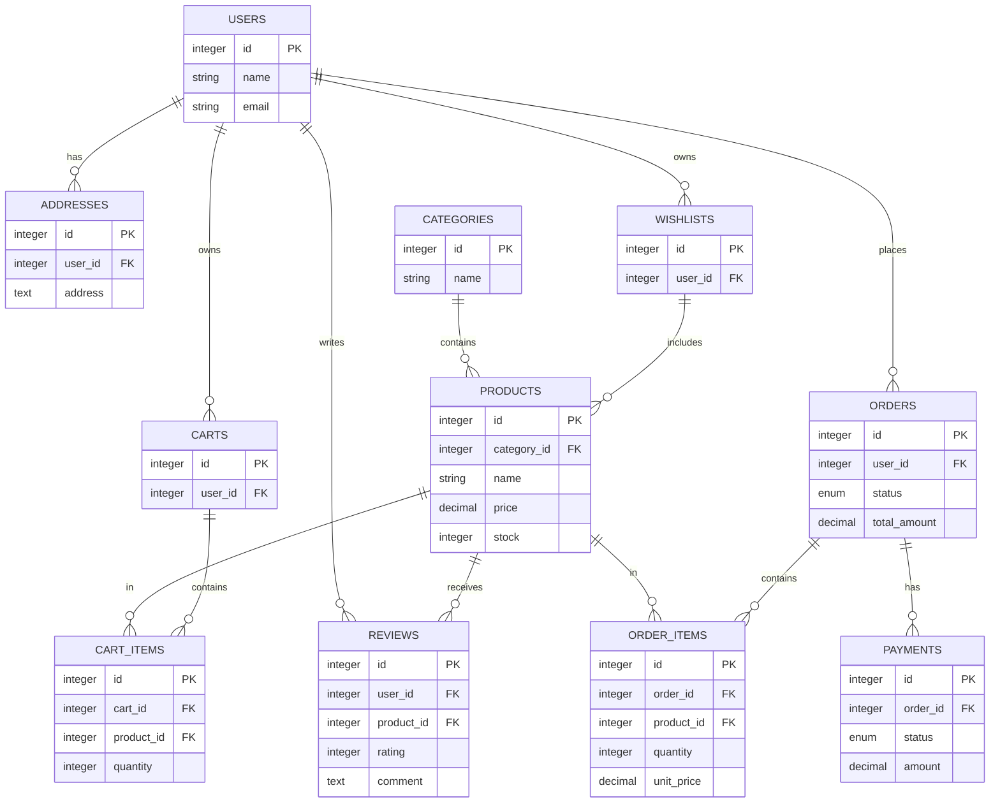
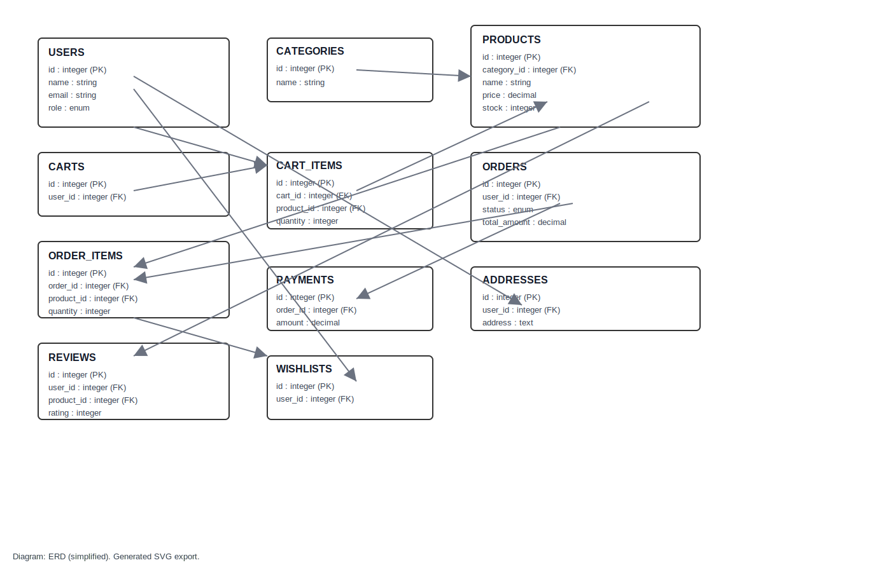
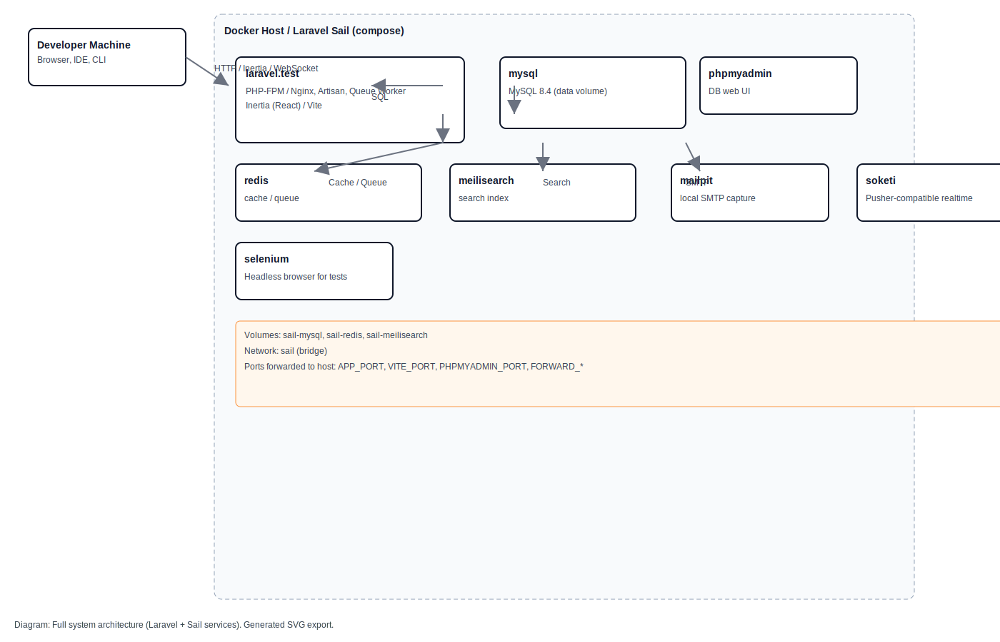

# Single-Vendor E-Commerce Shop

This repository contains a single-vendor e-commerce application built with Laravel (backend) and Inertia + React (frontend). It is set up for local development using Docker Compose (Laravel Sail compatible services) and includes features typical to an online shop: products, categories, carts, orders, payments, reviews, wishlists, and user management.

---

## Quick overview

- Backend: Laravel 13, PHP 8.3
- Frontend: React, Inertia, Vite, Tailwind CSS
- Database: MySQL (configured in `compose.yaml` / `.env.example`)
- Cache / Queue: Redis
- Search: Meilisearch
- Local mail testing: Mailpit
- Realtime (broadcast): Soketi
- Testing: Pest / PHPUnit

---

## High-level plan (what this README includes)

1. Checklist of actionable items (setup, run, tests)
2. How to run the app locally (Docker Compose / Sail / native)
3. System architecture diagram (component-level)
4. Data Relationship Diagram (DRD / ERD) using Mermaid
5. Important routes, models and migrations overview
6. Contributing, troubleshooting and FAQs

---

## Checklist (what I'll do for you now)

- [x] Create README with setup steps
- [x] Add system architecture diagram (Mermaid)
- [x] Add data relationship diagram (ERD / DRD via Mermaid)
- [x] Document primary routes, models and migrations
- [x] Document how to run tests and common commands

---

## Setup & Run (recommended: Docker Compose)

Prerequisites:

- Docker & Docker Compose OR Laravel Sail
- Node 18+ and npm / pnpm when developing frontend locally (optional if using Docker)

Steps (copy/paste):

```bash
# 1. Install PHP & Composer deps (if running locally without Docker)
composer install

# 2. Copy env & configure
cp .env.example .env
# Review .env for DB and other services or use the defaults in .env.example

# 3. Create SQLite (optional local) or use Docker/MySQL
php -r "file_exists('database/database.sqlite') || touch('database/database.sqlite');"

# 4. Run migrations & seeders
php artisan key:generate
php artisan migrate --seed

# 5. Install frontend deps & build
npm install
npm run build

# 6. Serve the app (native PHP server)
php artisan serve --port=8050

# OR use Docker Compose (recommended)
docker compose -f compose.yaml up --build

# For frontend dev with hot reload
npm run dev
```

Notes:

- `compose.yaml` in the repo configures services (mysql, redis, meilisearch, mailpit, soketi). If using Sail, adjust commands to `sail up` or the composer scripts in `composer.json`.
- The `.env.example` contains default ports and credentials used by the compose file.

---


## Data Relationship Diagram (DRD / ERD)

Below is a simplified ERD showing the main entities and relationships. Use this as a reference when extending the domain.



---

## Exported diagrams

I exported a static SVG of the ERD to `public/assets/erd.svg`. A PNG `public/assets/erd.png` is also referenced below — it will be generated from the SVG when possible (most Linux images include `rsvg-convert` or `convert`/ImageMagick).

If your environment (or CI) can render the SVG directly, GitHub and most browsers will display it inline. The PNG is provided as a fallback for environments that do not render SVG.

### Embedded previews

SVG (vector, scalable):




## Full system architecture (Docker Sail + Laravel)

I exported a static system architecture diagram to `public/assets/system-architecture.svg` and a PNG fallback at `public/assets/system-architecture.png`.

This diagram shows the developer machine, the Docker host running the `compose.yaml` services (laravel.test, mysql, redis, meilisearch, mailpit, soketi, phpmyadmin, selenium), the persistent volumes and the Sail network bridge. It also shows common traffic flows (HTTP/Inertia, SQL, cache/queue, search indexing and SMTP).

SVG (vector):




Notes:

- The Mermaid ER diagram above is intentionally simplified. For field-level details, consult the migration files in `database/migrations` (e.g. `create_products_table`, `create_orders_table`, `create_order_items_table`).

---

## Important files & where to look

- `app/Models/` — Eloquent models (User, Product, Category, Order, OrderItem, Cart, CartItem, Payment, Address, Review, Wishlist)
- `database/migrations/` — migrations that define the schema. Primary migrations include:
  - `create_users_table.php`
  - `create_products_table.php`
  - `create_categories_table.php`
  - `create_orders_table.php`
  - `create_order_items_table.php`
  - `create_cart_items_table.php`
- `routes/` — web routes: `web.php`, `settings.php` and others
- `resources/js` & `resources/views` — frontend resources (Inertia pages and React components)

---

## Common commands

- Install PHP dependencies: `composer install`
- Install JS dependencies: `npm install`
- Run migrations: `php artisan migrate`
- Run tests (Pest/PHPUnit): `php artisan test` or `./vendor/bin/pest`
- Start Docker services: `docker compose -f compose.yaml up --build`

Example dev run using composer script (defined in `composer.json`):

```bash
composer run-script dev
```

---

## Testing

This project includes tests under `tests/`. Run them with:

```bash
php artisan test
# or
./vendor/bin/pest
```

If you use the Selenium service in `compose.yaml`, you can run browser-based tests that require a headless browser.

---

## Contributing

If you plan to contribute:

1. Fork the repository
2. Create a feature branch
3. Follow existing code style (use `composer run-script lint` and `npm run lint`)
4. Add tests for your changes
5. Open a PR with a clear description of the change

---

